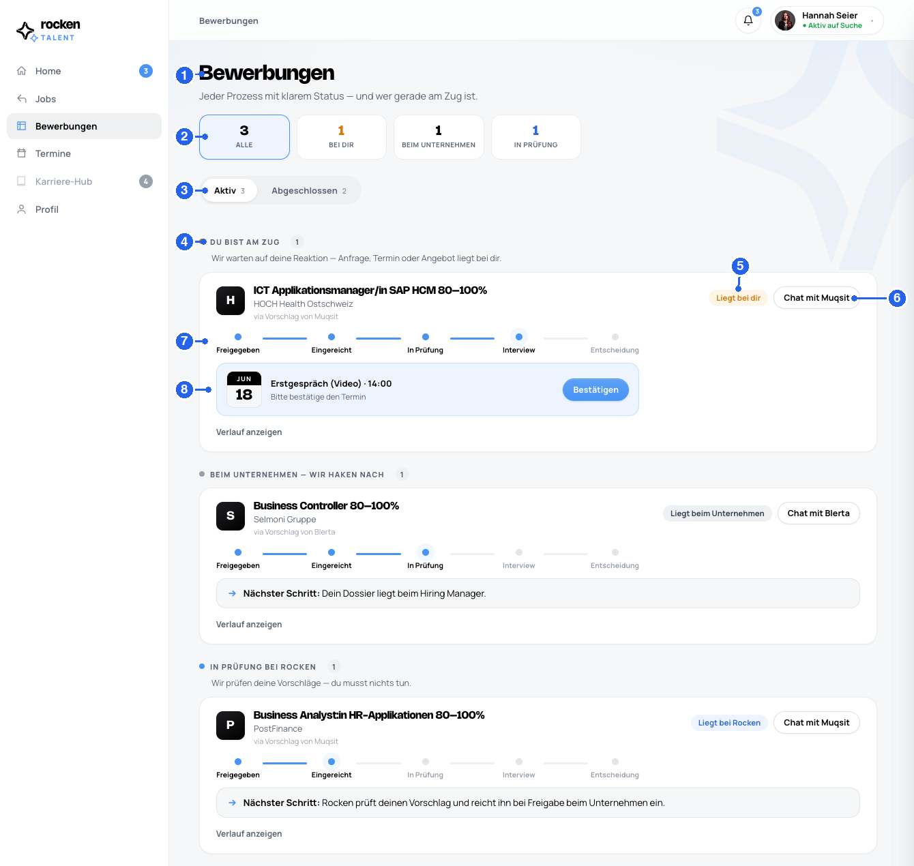
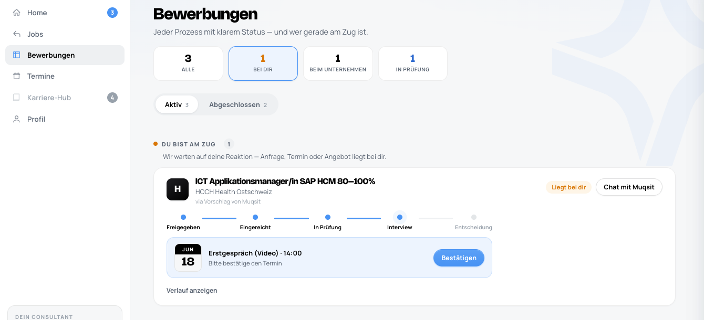
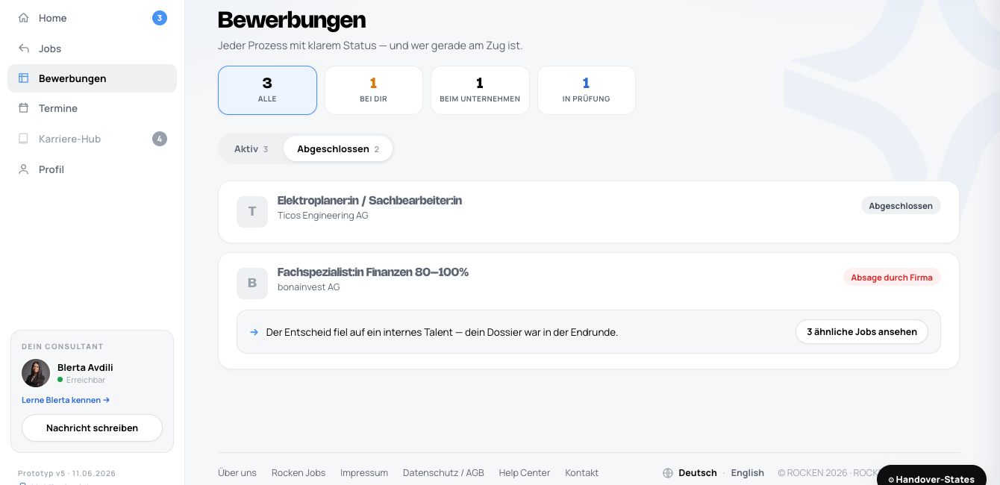
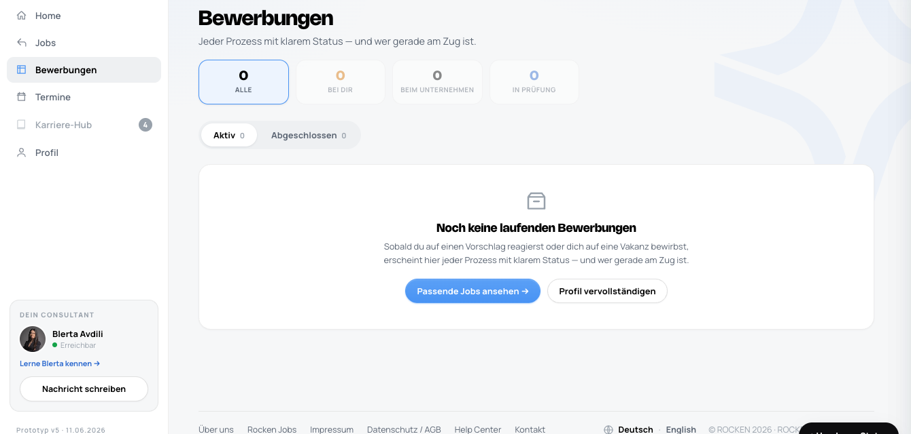

# Rocken Talent — Developer Handover · 3 · Bewerbungen (`bewerbungen`)

> **How to read this spec.** Numbered badges ①–⑧ on the screenshot map 1:1 to the tables.
> **Markdown = logic / rules / flows**; **Figma Dev Mode = visuals**.
> **Global rules** (architecture, auth, matching, notifications, NFRs, glossary) live in [`handover-00-overview.md`](handover-00-overview.md) — this page only covers what's Bewerbungen-specific.
> ⚠ **FUTURE** · 🔧 **BUILD** (not in prototype) · ❓ **TBD**.

### Purpose
The candidate's **process tracker**: every active application, grouped by **"who's at bat"** (the candidate, the company, or Rocken), plus a completed/archive tab. Read-mostly — the only candidate actions are **confirming an interview** and **opening the consultant chat**. Stages themselves advance in the CRM.

### Data sources
All read from the **CRM** (see Overview §2).
| Data | Source |
|---|---|
| Applications / processes + pipeline stage | CRM |
| **Owner** ("wer ist am Zug") | **derived from CRM status** |
| Responsible consultant (per process) | CRM — process creator; self-application = vacancy owner (Overview §6) |
| Appointment (interview date) | CRM |
| Timeline / history | CRM |

### ① – ⑧ Element order & display logic
| # | Element | Content | Logic |
|---|---|---|---|
| **①** | Page header | "Bewerbungen" + subtitle | always |
| **②** | **Stat tiles = category filters** | Alle · Bei dir · Beim Unternehmen · In Prüfung (with counts) | **clickable** → filters the list to that category; active tile highlighted; a **zero-count** tile is dimmed. Counts reflect **active** processes. |
| **③** | Tabs | **Aktiv** · **Abgeschlossen** (with counts) | switches active list ↔ archive |
| **④** | Category group head + hint | groups the active list by **"who's at bat"** | **Empty groups are omitted.** Each has a colored dot + count + one-line hint. |
| **⑤** | Owner pill | "Liegt bei dir" (amber) · "Liegt beim Unternehmen" (gray) · "Liegt bei Rocken" (blue) · "Termin fixiert" (blue) | derived from CRM owner/status |
| **⑥** | Chat button | "Chat mit {consultant}" | → consultant chat; **messages go to the CRM** (Overview §6) |
| **⑦** | Pipeline | **5 fixed stages: Freigegeben · Eingereicht · In Prüfung · Interview · Entscheidung** | done / current derived from the CRM stage |
| **⑧** | Appointment block *(or)* next-step | interview date + label + **"Bestätigen"** → "✓ Fixiert" · *else* a **"Nächster Schritt: …"** line | the appointment block shows **only when an interview is scheduled**; otherwise the next-step line shows |

### Category mapping — "who's at bat" *(product-confirmed)*
| Group (④) | Tile (②) | Dot | CRM owner | Meaning |
|---|---|---|---|---|
| **Du bist am Zug** | Bei dir | amber | `dir`, `fixiert` | waiting on the **candidate** — request, appointment or offer lies with them |
| **Beim Unternehmen — wir haken nach** | Beim Unternehmen | gray | `firma` | at the **company**; Rocken follows up |
| **In Prüfung bei Rocken** | In Prüfung | blue | `rocken` | **Rocken** is reviewing the proposal |
| **Abgeschlossen** *(tab)* | — | — | `archived` | any process where the vacancy **or** the candidate was set inactive |

### Card anatomy (`pipeCard`)
- Logo · title · company · **origin** ("via Vorschlag von {consultant}")
- **Owner pill** + **Chat** button (top-right)
- **5-stage pipeline** (done / current / upcoming)
- **Appointment block** (if interview scheduled) **or** **"Nächster Schritt: …"** line
- **"Verlauf anzeigen"** → expands the **timeline** (reverse-chronological; future steps dimmed)

### Actions (candidate-side)
| Action | Result |
|---|---|
| **Bestätigen** (interview) | marks the appointment confirmed → "✓ Fixiert", "liegt in deinem Kalender" |
| **Chat mit {consultant}** | opens the chat; messages land in the **CRM** |
| everything else | **read-only** — pipeline stages are advanced by consultants **in the CRM** (Overview §5) |

### No timeframe promises
Per the global content rule (Overview §8), cards show status **without deadlines** — "Nächster Schritt: …" and category hints, **never** "Rückmeldung bis …".

### States & edge cases
Reproduce via the **Handover-States** toolbar or clicks (`appTab`/`appFilter` are not URL params; `processes` is a `?demo=` toggle).

| State | Trigger | Result |
|---|---|---|
| **Category filter** | click a stat tile | list narrows to that group; tile highlighted (below) |
| **Abgeschlossen** | tab | archived cards: "Abgeschlossen" / "Absage durch Firma" chip + optional feedback + "3 ähnliche Jobs" |
| **Filter empty** | filter with no items | "Keine Prozesse in dieser Kategorie" + "Alle anzeigen" |
| **No processes** | `?demo=processes:0#bewerbungen` | full empty-state card + CTAs (→ Jobs / Profil) |

**Filtered by category** (here: "Bei dir")

**Abgeschlossen** (archive)

**No processes** — `?demo=processes:0#bewerbungen`

### Open / to confirm
- ❓ Exact **CRM status → owner / pipeline-stage** mapping (prototype uses `dir/fixiert/firma/rocken/archived` + 5 stages).
- ❓ **Archive-reason taxonomy** (Abgeschlossen / Absage durch Firma / …) and whether feedback text is always present.

---
*Live: https://dennistodesco-star.github.io/handover_proto_Talent/ (`#bewerbungen` · `?demo=processes:0#bewerbungen`) · Source: `index.html`*
