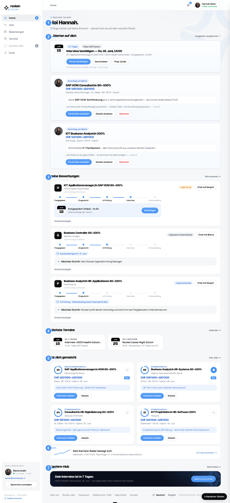

# Rocken Talent — Developer Handover

## Screen 1 · Home / Dashboard (`cockpit`)

> **How to read this spec.** The numbered badges ①–⑦ on the screenshot map 1:1 to the rows in the table below.
> **Markdown = logic / rules / flows** (the "why & when"). **Figma Dev Mode = visuals** (measurements, tokens, assets).
> ⚠ **FUTURE** = designed but **not part of the MVP** (greyed out in the product).

### Purpose
Post-login landing screen. Surfaces what needs the candidate's attention, their active processes, upcoming appointments, and fresh recommendations. Read-mostly; primary actions link into deeper screens.

### Data sources
All data is **read from the CRM / Matching API** — the frontend only renders it (the CRM/API is built by Rocken IT, not this frontend).

| Data | Source |
|---|---|
| Candidate profile + account status | CRM |
| Consultant proposals (pushed by a consultant) | CRM |
| Applications / processes + their status | CRM |
| Appointments / events | CRM |
| Recommendations (job-id, match score, `why` text) | Matching engine |

### Element order & display logic

| # | Block | Content | Renders when | Empty behavior | Links / actions |
|---|---|---|---|---|---|
| **(0)** | Inactive-status banner | "Profile inactive" + reactivation CTA | **only if** account status = *inactive* | not rendered | `requestReactivation()` → request sent; **approval happens in CRM** |
| **①** | Greeting + status + profile-completeness | "Hoi {firstName}", search-status, completeness % | always | — | status pill; completeness ring → Profile |
| **②** | **"Warten auf dich"** | Open tasks (e.g. confirm interview) **+ consultant proposals** (channel: *consultant-pushed*) | always | "Alles erledigt" state | proposal → detail modal · "Angebote vergleichen" if > 1 proposal |
| **③** | **"Deine Bewerbungen"** | Preview of active processes, grouped by *who's at bat* | always | Empty state **with CTA** (→ Jobs / Profile) | → Bewerbungen |
| **④** | **"Nächste Termine"** | Upcoming appointments / events | **only if events exist** | **hidden** when empty | → Termine |
| **⑤** | **"Für dich gematcht"** | **Recommender** matches (channel: *algorithmic*) | always | No-match CTA (→ complete profile / browse) | → Jobs |
| **⑥** | Career-Radar teaser | Market-value trend | always | — | → Karriere-Hub · ⚠ **FUTURE** |
| **⑦** | **"Karriere-Hub"** banner | Article / prep teaser | always | — | → Karriere-Hub · ⚠ **FUTURE** |

### Ordering rule
Default order = as above, **but dynamic**: the **most urgent action always bubbles to the top**, and the order is **personalized by candidate segment/status**. The table describes the normal case; the rule is "urgent action first".

### Key display rules
- **Match score (%)** — rendered **only on recommender matches** (⑤ and Jobs → "Für dich"), and **only when score ≥ 70 %**. **Never** on consultant proposals (②) or self-search ("Alle Vakanzen").
- **Two proposal texts** — `why` (why-you-match) is **LLM/engine-generated**; `note` (the quote with the consultant's name) is **written by the consultant** (CRM field).
- **No recommendations** when: profile < 70 % complete **OR** account not activated **OR** the engine finds no matching internal vacancy.
- **Empty sections are mixed** — some are **hidden** when empty (e.g. ④ Termine), others **always show with a CTA** (e.g. ③ Bewerbungen, ⑤ Matches).
- **Responsible consultant** = whoever **created the process in the CRM**; for a **self-search / self-application** it is the **consultant responsible for the vacancy**.
- **Cookie consent** overlays on first visit until dismissed (global, all screens).
- ⚠ **FUTURE (out of MVP):** Karriere-Hub (⑥ ⑦), Zeugnis-Decoder/Generator, Interview-Preparation.

### Compare flow — "Angebote vergleichen" (initiated from ②)
Lets the candidate compare multiple **consultant proposals** side-by-side.

- **Entry** — link **"Angebote vergleichen ⇄"** in the ② header; shown **only when > 1 proposal** exists.
- **Compare mode** — each proposal card becomes selectable: a checkbox appears (top-right) **and the whole card is clickable** to toggle selection (selected = blue ring). The header link switches to **"Vergleich abbrechen ✕"**.
- **Selection** — **2–4 offers** (hard cap 4; toast on the 5th).
- **Tray** — a docked bottom tray shows the selected companies (each removable via ×) + a **"Vergleichen (N)"** button, **disabled until ≥ 2** are selected.
- **Compare view (modal)** — selected offers **side-by-side** in a table. Rows: **Match · Lohnband · Standort · Pensum · Modell · Pendelzeit · Firma**. The **best value per row is highlighted** (highest Match/Lohnband, shortest Pendelzeit). **Rows where no offer has a value are hidden.**
- **Guest masking** — logged-out: *Standort* → region only, *Firma* → "Vertraulich".
- **Exit** — "Vergleich abbrechen" (header) or "Abbrechen" (tray).
- **State** — `compareMode`, `compareSel[]` (global). Note: consultant proposals carry **no match score**, so the *Match* row is empty for them and auto-hidden (consistent with the score rule).

### Open / to confirm
- Exact **account-status taxonomy** (the CRM likely has more than the 4 prototype statuses).
- **Sort order within lists** (proposal order; matches by score desc?).

---
*Live prototype: https://dennistodesco-star.github.io/handover_proto_Talent/ · Source: `index.html` (`index-redesign.html`)*
