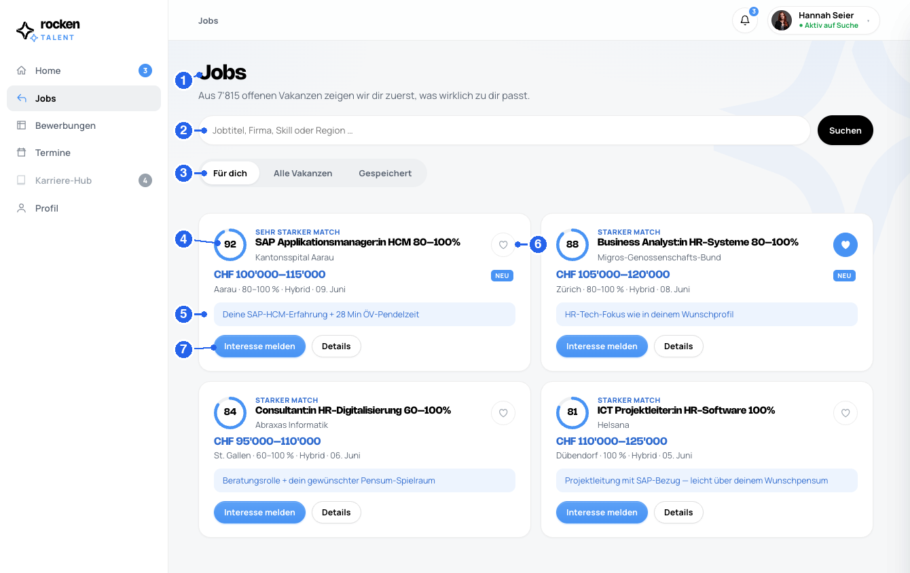
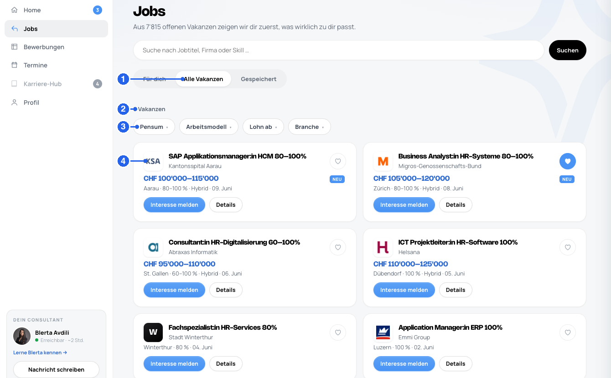
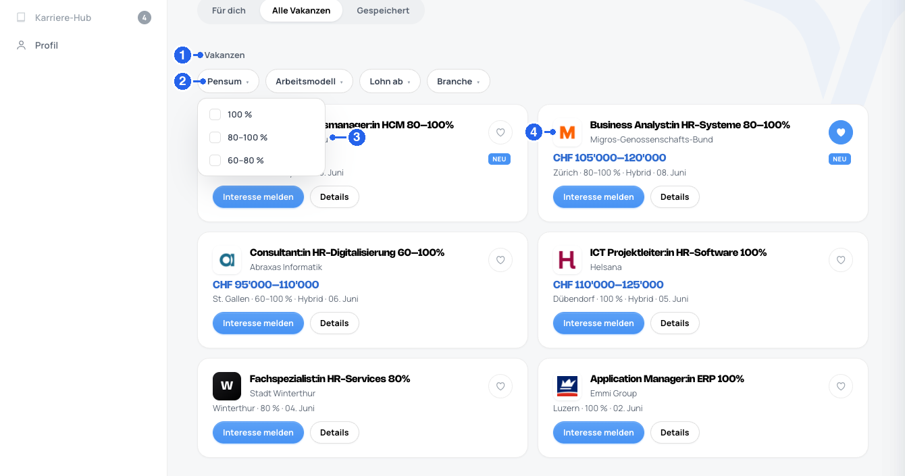
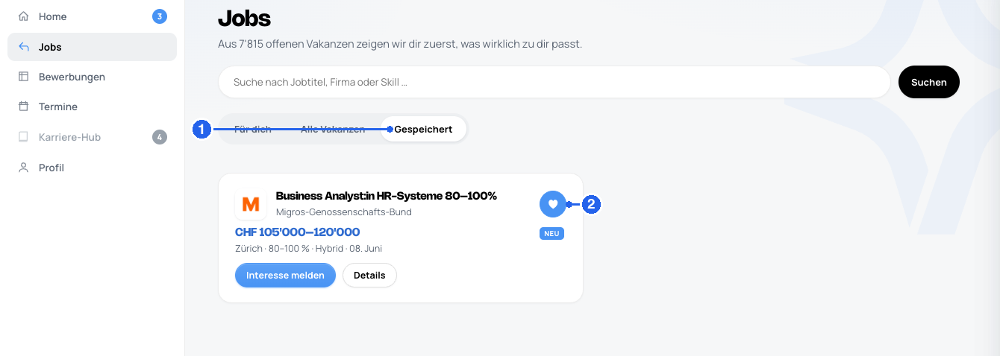
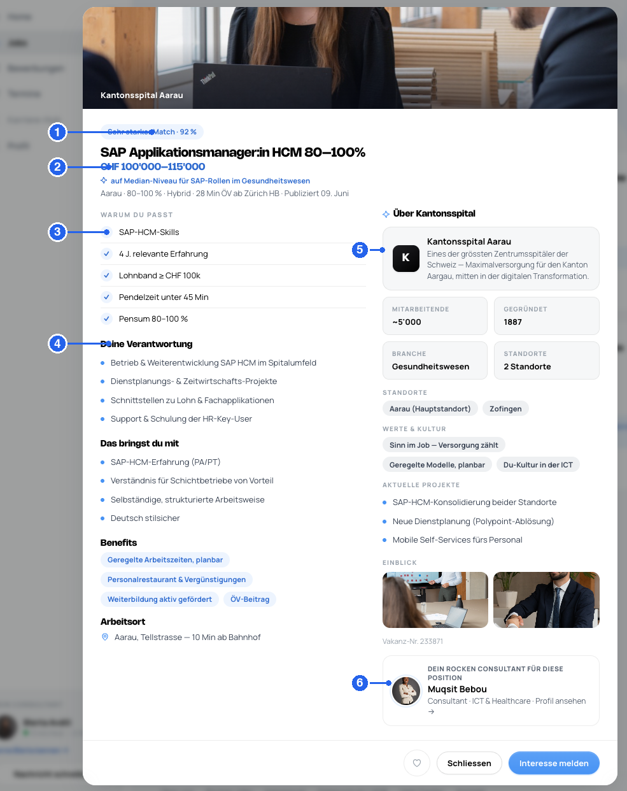

# Rocken Talent — Developer Handover · 2 · Jobs & Suche (`jobs`)

> **How to read this spec.** Numbered badges ①②③ on the screenshots map 1:1 to the tables.
> **Markdown = logic / rules / flows**; **Figma Dev Mode = visuals** (measurements, tokens, assets).
> **Global rules** (architecture, auth, matching, masking, NFRs, glossary) live in [`handover-00-overview.md`](handover-00-overview.md) — this page only covers what's Jobs-specific.
> ⚠ **FUTURE / not MVP** · 🔧 **BUILD** (not in prototype yet) · ❓ **TBD**.

### Purpose
The job-discovery screen. Two jobs of work sit here: **(a)** show the candidate the **recommender matches** ("Für dich") — the personalized, ranked, scored list; **(b)** let them **self-search** the full vacancy pool ("Alle Vakanzen") with filters. Both feed the same **"Interesse melden"** flow.

### Data sources
| Data | Source | Note |
|---|---|---|
| Recommender matches (job-id, **score**, `reason`/`why`) | **Matching engine** | Only the "Für dich" tab. |
| Full vacancy list ("Alle Vakanzen") | **CRM jobs** | Created **daily / fresh**. |
| Search + filter results | **CRM (backend-driven)** | Prototype filters client-side as a stand-in; production filters/searches in the backend. |
| Company name / logo / location | **CRM** | Logos stored in CRM. Masked for guests (see below). |
| Saved / interested / applied flags | **CRM** | Per candidate–vacancy. |

### ① – ⑦ Element order & display logic ("Für dich")
| # | Element | Content | Logic |
|---|---|---|---|
| **①** | Page header | "Jobs" + context line ("Aus N offenen Vakanzen …") | always |
| **②** | Search bar | Free-text: **job title, company or skill** | Enter / "Suchen" → runs the search **and switches to "Alle Vakanzen"**. A **recent-searches dropdown** suggests the last queries (see below). |
| **③** | Tabs | **Für dich · Alle Vakanzen · Gespeichert** | see *Tabs* below |
| **④** | Match score ring | 0–100 % + **match label** | **Recommender only, only ≥ 70 %.** Label tiers: **≥ 90 = "Sehr starker Match" · ≥ 80 = "Starker Match" · ≥ 70 = "Guter Match"**. On the other tabs the ring is replaced by the **company logo** and no score shows. |
| **⑤** | `reason` / `why` pill | One-line "why you match" | **Recommender only.** Engine/LLM-generated. Absent on self-search cards. |
| **⑥** | Save (heart) | Toggle save | → the vacancy appears under the **"Gespeichert"** tab. |
| **⑦** | Card actions | **"Interesse melden"** + **"Details"** | "Interesse melden" → interest flow (goes to the consultant, see Overview §5). "Details" → **Vakanz-Detail** screen. State-dependent: shows **"✓ Interesse gemeldet"** or **"✓ Beworben"** (disabled) once done. |

### Tabs
| Tab | Shows | Score? | Filters? |
|---|---|---|---|
| **Für dich** *(default)* | `rankedMatches()` — recommender matches, ranked | **Yes** (≥ 70 %) | no |
| **Alle Vakanzen** | Full CRM vacancy pool (self-search) | **No** | **Yes** |
| **Gespeichert** | Vacancies the candidate saved (heart) | No | no |
| ~~Gespeicherte Suchen~~ | *(prototype/Figma-only)* | — | — | ⚠ **Not MVP** — see *Saved searches* |

### "Alle Vakanzen" (self-search) & filters
The full CRM vacancy pool. Cards are in **plain mode** — company logo, **no score, no `why` pill**.

| # | Element | Logic |
|---|---|---|
| **①** | Active tab | "Alle Vakanzen" |
| **②** | Result count | "N Vakanzen" (+ " · gefiltert" when filters active) |
| **③** | Filter controls | **Pensum · Arbeitsmodell · Lohn ab · Branche** — multi-select popovers; each shows an active count |
| **④** | Plain job card | **company logo**, **no score**, **no `why` pill** — otherwise identical (title, company, salary band, location · pensum · model · date, save, actions) |

**Filter popover** — each control opens a multi-select list (e.g. Pensum → 100 % / 80–100 % / 60–80 %):

- Active filters render as removable **chips** below the bar + a **"Zurücksetzen"** reset.
- Filtering/search is **backend-driven** in production (the prototype's keyword matching is only a stand-in).
- Two filter layouts exist in the prototype (inline **bar** vs. **drawer**) — a visual choice, same logic. Pick one for build.

### Job-card anatomy
Same card component in two modes (`matchCard(job, plain)`):
- **Match mode** (Für dich): score ring + match label + `reason` pill.
- **Plain mode** (Alle Vakanzen / Gespeichert): company logo, no score, no reason.
- Shared: title, company, **salary band**, **"Neu"** badge (recent postings), meta line (location · workload · model · posted date), save heart, **Interesse melden / Details**.

### "Gespeichert" tab
Everything the candidate saved via the heart.

| # | Element | Logic |
|---|---|---|
| **①** | Active tab | "Gespeichert" |
| **②** | Saved card | Any vacancy with the **heart toggled on**; un-hearting removes it here. Plain mode, no filters. |

Empty → an empty-state hint (nothing saved yet).

### Vacancy quick-detail — the "Details" modal
"Details" on any job card opens a **modal** (`openJob`) — a quick, in-place deep-dive without leaving the list. *(A separate **full-page** vacancy view also exists — spec #5, coming.)*

| # | Element | Content | Logic |
|---|---|---|---|
| **①** | Match chip | match label + score | recommender only; on self-search it reads "Vakanz" (no score) |
| **②** | Title · salary band · benchmark | position, `salary`, market benchmark | benchmark shown when the CRM provides it |
| **③** | "Warum du passt" | criteria list with ✓ (met) / – (missing) | recommender/`criteria` only; **logged-in only** |
| **④** | Role content | Deine Verantwortung · Das bringst du mit · Benefits · Arbeitsort | from the vacancy (CRM) |
| **⑤** | Company block | logo, about, employees, founded, industry, locations, culture, projects, gallery, Vakanz-Nr. | from the **CRM**; **masked for guests** (🔒 cover + login wall) |
| **⑥** | Responsible consultant | the consultant for this position → opens their profile | see Overview §6 |
| — | Footer | **save** · Schliessen · **Interesse melden** (→ "✓ Interesse gemeldet" once done; login CTA for guests) | |

### No-match & empty states
The "Für dich" tab shows a **no-match card** (instead of results) when `noMatchReason()` returns one of — mirrors Overview §4:
| Reason | Trigger | CTA |
|---|---|---|
| `activation` | account not activated yet | prompts activation |
| `profile` | profile completeness **< 70 %** | prompts profile completion |
| `manual` | engine finds no matching internal vacancy | → browse "Alle Vakanzen" |

"Alle Vakanzen" / "Gespeichert" empty → "Keine Treffer für diese Filter" + reset link.

### Guest masking
For logged-out visitors, **company data is hidden** — logo/name and exact location are masked (region only); confidential vacancies show a **"🔒 Vertrauliches Unternehmen"** cover. The **"confidential" flag is defined in the CRM** (see Overview §8).

### Saved searches — ⚠ Not MVP
The prototype shows "Gespeicherte Suchen" (a tab, a search-dropdown section, "Aktuelle Suche speichern"). **This is not a product feature.** Search-alert e-mails are sent **separately via Marketing**, not built into RT. Treat as demo-only; do **not** build unless scoped later.

### Recent-searches dropdown
On focus, the search bar offers a dropdown: **"Zuletzt gesucht"** (last queries) → re-runs the search. (The "Gespeicherte Suchen" section of that dropdown falls under *Saved searches* above.)

### Open / to confirm
- ❓ Exact **match-label thresholds** & wording (prototype uses ≥90 / ≥80 / ≥70).
- ❓ **Ranking/sort** of "Für dich" (score desc?) and of "Alle Vakanzen" (newest first?).
- ❓ Which **filter facets** the CRM actually supports (prototype: Pensum, Modell, Lohn, Branche).

---
*Live: https://dennistodesco-star.github.io/handover_proto_Talent/ (`?jt=match#jobs` · `?jt=all#jobs` · `?jt=saved#jobs` · `?openjob#jobs`) · Source: `index.html`*
